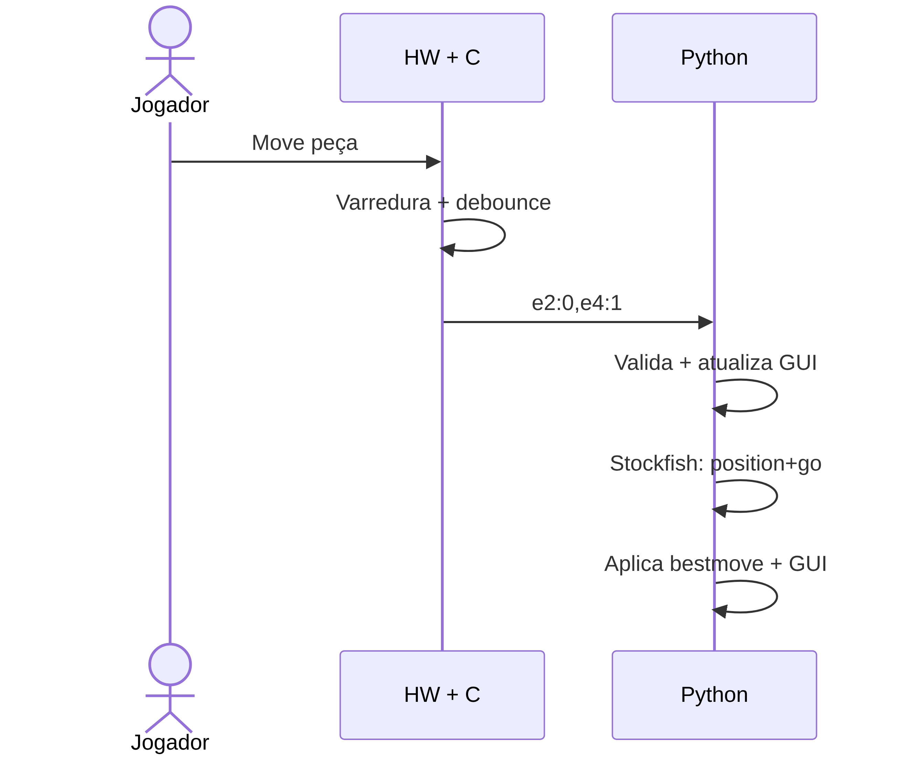
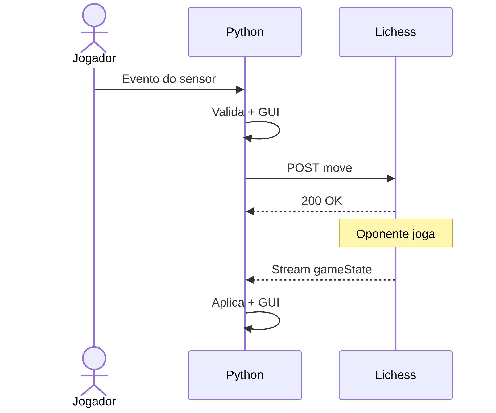
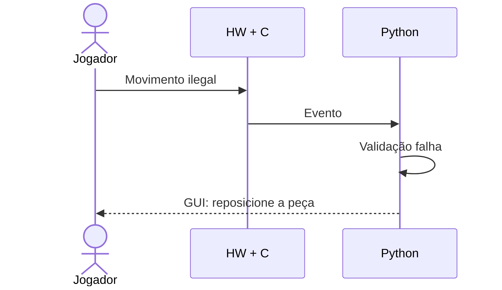
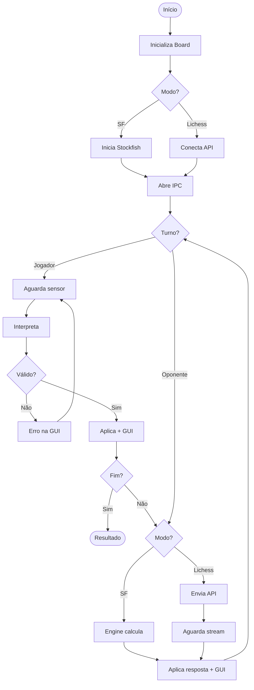

# Tabuleiro de Xadrez Eletrônico com Integração a Chess Engine

## 1. Motivação e Visão Geral

O xadrez é tradicionalmente jogado de duas formas: presencialmente, sobre um tabuleiro físico, ou digitalmente, através de interfaces que permitem partidas contra motores de análise (*chess engines*). Este projeto une essas duas experiências: o jogador utiliza peças físicas reais sobre um tabuleiro instrumentado eletronicamente, enquanto o oponente — uma engine ou um jogador online — é representado apenas na interface gráfica.

Para viabilizar essa proposta, o sistema precisa: (1) detectar com precisão os movimentos físicos sem intervenção manual; (2) traduzir essas detecções em jogadas válidas para o Stockfish ou para o Lichess; e (3) refletir o estado completo do jogo em uma GUI responsiva.

---

## 2. Objetivos

**Geral:** Projetar e implementar um tabuleiro de xadrez eletrônico que detecte movimentos de peças físicas e os comunique a uma chess engine ou à plataforma Lichess, exibindo o estado completo da partida em interface gráfica.

**Específicos:**

1. Construir um tabuleiro 8×8 com reed switches e diodos anti-ghosting.
2. Desenvolver firmware de varredura matricial com latência < 200 ms e 100% de precisão.
3. Implementar interpretação de movimentos (capturas, roque, en passant, promoção).
4. Integrar com Stockfish via protocolo UCI.
5. Integrar com Lichess Board API para partidas online.
6. Desenvolver GUI com Pygame que renderize as 32 peças em tempo real.
7. Criar suíte de testes automatizados independente de hardware/rede/display.

---

## 3. Ferramentas Utilizadas

| Categoria | Item | Uso |
|:----------|:-----|:----|
| Linguagem | **Python 3.10+** | Lógica de jogo, validação, engines, API, GUI |
| Linguagem | **C/C++ (Arduino)** | Firmware de varredura da matriz de sensores |
| Linguagem | **Nix / Make** | Ambiente reprodutível e automação |
| Biblioteca | **python-chess** ≥ 1.10 | Estado do tabuleiro, validação, interface UCI |
| Biblioteca | **Pygame** ≥ 2.5 | Renderização da GUI |
| Biblioteca | **Requests** ≥ 2.31 | Comunicação HTTP com Lichess Board API |
| Externo | **Stockfish** | Chess engine (UCI) |
| Externo | **Lichess Board API** | Partidas online com tabuleiros físicos |
| Externo | **SimulIDE** | Simulação do circuito eletrônico |
| Hardware | **Reed switches** (64×) | Sensores magnéticos, 1 por casa |
| Hardware | **Diodos 1N4148** (64×) | Anti-ghosting |
| Hardware | **Ímãs neodímio** ⌀6 mm (16×) | Embutidos nas peças do jogador |
| Hardware | **Arduino Mega 2560** (PoC) | Microcontrolador da prova de conceito |
| Hardware | **Raspberry Pi 4** (final) | Controlador da versão final |

---

## 4. Metodologia de Desenvolvimento

Ciclo **iterativo e incremental** organizado em entregas semanais. Repositório único com branch `main`; a partir da Semana 2, branches dedicadas com integração via Pull Request.

**Validação em camadas:**

1. **Testes automatizados** (`tests/`): lógica de aplicação, sem hardware/rede/display. Servidor HTTP falso e mocks de IPC/engine.
2. **PoC de hardware** (`poc_xadrez/`): sketch Arduino validando varredura matricial com reed switches.
3. **Mock de hardware** (`mock/`): simulador gráfico que emula eventos de sensores.
4. **Sondas de integração** (`tests/probe_*.py`): validação contra a API real do Lichess.

Documentação com **docstrings em padrão Google** em todos os módulos Python, relatório em Markdown com exportação para PDF via Pandoc.

---

## 5. Especificação de Requisitos

### 5.1 Requisitos Funcionais

| ID | Requisito | Critério de Teste |
|:---|:---------|:------------------|
| **RF1** | Detecção das peças no tabuleiro físico e de seus movimentos. | Realizar movimentos válidos e capturas; o sistema deve registrar corretamente origem e destino. |
| **RF2** | Comunicação com chess engine como oponente. | Enviar estado via UCI após jogada; a engine deve retornar movimento válido. |
| **RF3** | Exibição gráfica de ambas as partes (peças físicas e virtuais). | A tela deve renderizar 32 peças refletindo a posição exata. |

### 5.2 Requisitos Não-Funcionais

| ID | Requisito | Critério de Teste |
|:---|:----------|:------------------|
| **RNF1** | Detecção rápida e sem falhas. | 100 movimentos sequenciais: 100% precisão, leitura < 200 ms. |
| **RNF2** | GUI sem latência considerável. | Latência de renderização < 100 ms após o gatilho. |
| **RNF3** | Robustez contra falsos positivos. | Esbarrões e trepidações não devem gerar movimentos espúrios. |

---

## 6. Arquitetura Proposta

### 6.1 Visão Geral

Três camadas — **Hardware/Sensoriamento**, **Controle Low-Level (C)** e **Aplicação (Python)** — interligadas por IPC. O tabuleiro é instrumentado com uma matriz 8×8 de reed switches. Um processo C dedicado realiza varredura e debouncing; um processo Python mantém a lógica do jogo, valida jogadas, comunica-se com Stockfish/Lichess e renderiza a GUI.

### 6.2 Diagrama de Blocos — Arquitetura de Software

### 6.3 Arquitetura Física

| Conexão | Detalhes |
|:--------|:---------|
| Switches → MCU | 8 linhas OUTPUT LOW + 8 colunas INPUT_PULLUP. Diodo 1N4148 em série anti-ghosting. |
| Arduino → Host (PoC) | Serial UART 115200 baud via USB. Matriz 8×8 booleana em texto. |
| RPi GPIO → Proc. C (final) | Acesso direto via `pigpio` ou registradores, sem overhead de serial. |
| Proc. C → Proc. Python | Named Pipe (FIFO). Eventos tipo `e2:0,e4:1`. Latência ~µs. |
| Python → Stockfish | stdin/stdout, protocolo UCI. |
| Python → Lichess | HTTPS REST + NDJSON streaming (Board API). |

### 6.4 Diagramas de Sequência

#### 6.4.1 Jogada contra Stockfish

#### 6.4.2 Jogada Online via Lichess

#### 6.4.3 Rejeição de Movimento Inválido

### 6.5 Fluxograma — Lógica Principal (Python)

### 6.6 Mapeamento Requisitos × Arquitetura

| Requisito | Mecanismo |
|:----------|:----------|
| **RF1** | Varredura matricial → GPIO → Diff identifica casas alteradas. Tipo da peça mantido por mapa lógico no software. |
| **RF2** | `python-chess` encapsula UCI: envia FEN + histórico ao Stockfish, recebe `bestmove`. |
| **RF3** | Motor de Estado mantém representação canônica; GUI renderiza 32 peças consultando-o. |
| **RNF1** | Ciclo ~10 ms + debouncing 5 ciclos ≈ 50–60 ms (< 200 ms). Diodos anti-ghosting. |
| **RNF2** | Named Pipe (~µs) + renderização incremental (só casas alteradas). |
| **RNF3** | Dupla barreira: debouncing em C + validação semântica em Python. |

### 6.7 Justificativas Arquiteturais

| Decisão | Justificativa |
|:--------|:-------------|
| **Dois processos (C + Python)** | C oferece controle direto de GPIO com temporização precisa; Python dispõe de `python-chess` para validação e UCI. |
| **Named Pipe (FIFO)** | IPC nativo do Linux, simples e adequado para eventos curtos e esporádicos. |
| **Varredura matricial + diodos** | 64 sensores com apenas 16 pinos GPIO. Diodos previnem ghosting com múltiplas peças. |
| **Debouncing em software** | Evita 128 componentes extras (RC); threshold ajustável; RPi tem capacidade de sobra. |
| **UCI / Stockfish** | Padrão de facto, stateless, baseado em texto. Stockfish é a engine open-source mais forte. |
| **Lichess Board API** | Projetada para tabuleiros físicos com contas regulares (diferente da Bot API). |
| **Renderização incremental** | Redesenha apenas casas alteradas, garantindo < 100 ms de latência visual. |

---

## 7. Desenvolvimento

Na primeira semana, o grupo focou na prototipação: lógica de detecção de movimentos conectada ao Lichess e ao Stockfish, com GUI funcional.

**Módulos implementados:**

| Módulo | Responsabilidade |
|:-------|:----------------|
| `app/main.py` | Ponto de entrada, orquestração dos modos de execução |
| `app/game_state.py` | Motor de estado (python-chess): posição, FEN, histórico |
| `app/move_interpreter.py` | Converte eventos de sensor em jogadas (captura, roque, promoção) |
| `app/ipc_reader.py` | Recebe e desserializa eventos do processo C / mocks |
| `app/gui.py` | Interface gráfica com Pygame |
| `app/stockfish_engine.py` | Integração UCI com Stockfish |
| `app/lichess_client.py` | Board API do Lichess (seek, desafios, streams) |
| `app/config.py` | Configuração centralizada |
| `poc_xadrez/poc_xadrez.ino` | Firmware Arduino: varredura matricial + Serial |
| `mock/hardware_mock.py` | Simulador de eventos de sensores |

---

## 8. Testes

### 8.1 Suíte Automatizada

Executável com `make test`. Sem dependência de rede, token, Stockfish ou display.

| Suíte | Arquivo | Cenários | Cobertura |
|:------|:--------|:--------:|:----------|
| Lichess | `test_lichess.py` | 35 | Auth, seek, streams, tempo, cor, sinc. lances, recusa, threads |
| Desafios | `test_challenge.py` | 5 | Criação, aceite, rejeição, cancelamento, user inexistente |
| Stockfish | `test_stockfish_loop.py` | 5 | Partida completa, captura→instrução física, ressincronização |
| **Total** | | **45** | |

**Infraestrutura:** `fake_lichess.py` — servidor HTTP que imita a Board API (account, seek, streams, lances, desafios). Aceita token `faketoken123`, recusa inválidos (401).

### 8.2 Rastreabilidade Requisito × Teste

| Req. | Validação | Status |
|:-----|:----------|:-------|
| **RF1** | `test_stockfish_loop`: eventos de sensor → movimentos corretos. Mock visual. | SW ✅ · HW pendente |
| **RF2** | `test_stockfish_loop`: engine falsa retorna bestmove, estado consistente. | SW ✅ |
| **RF3** | Mock com GUI (`make mock`): verificação visual da renderização. | Visual ✅ |
| **RNF1** | 100% dos eventos simulados detectados. Latência real na Semana 3. | Precisão ✅ · Latência pendente |
| **RNF2** | Instrumentação de timestamps prevista para Semana 3. | Pendente |
| **RNF3** | Ressincronização após inconsistência testada. HW real na Semana 3. | SW ✅ |

### 8.3 Testes Planejados

| Semana | Teste | Requisito |
|:-------|:------|:----------|
| 2 | Cenários de roque, en passant e promoção no `move_interpreter` | RF1 |
| 3 | Integração HW–SW: latência real + 100 movimentos sequenciais | RNF1, RNF3 |
| 4 | Aceitação: partida completa (Stockfish + Lichess) com tabuleiro real | Todos |

---

## 9. Conclusões

A primeira entrega atingiu seu objetivo: definir a arquitetura e validar a viabilidade técnica. A PoC de hardware confirmou a varredura matricial com reed switches; a aplicação Python está funcional de ponta a ponta (Stockfish e Lichess); e a suíte de 45 testes automatizados — com servidor HTTP falso e mocks — valida o software sem dependência externa.

**Dificuldades:** engenharia reversa da Board API do Lichess (restrições não documentadas exigiram criação de sondas), equilíbrio debouncing vs. responsividade, e ghosting na matriz (resolvido com diodos).

**Lições:** a separação em camadas viabilizou desenvolvimento paralelo e mocks; testes com servidor falso eliminaram dependência de rede; Nix garantiu reprodutibilidade do ambiente.

**Próximos passos:** montagem física do tabuleiro (Semana 2), testes de integração HW–SW com medição de latência (Semana 3), teste de aceitação com partidas reais (Semana 4).

---

## 10. Referências

BASS, L.; CLEMENTS, P.; KAZMAN, R. **Software Architecture in Practice**. 3. ed. Boston: Addison-Wesley, 2012.

DIGIKEY. **Debouncing reed switches in embedded systems**. DigiKey Technical Articles, 2023. Disponível em: https://www.digikey.com/en/articles/how-to-implement-hardware-debounce-for-switches-and-relays. Acesso em: 16 jul. 2026.

FIEKAS, N. **python-chess: a chess library for Python**. Documentação oficial, 2024. Disponível em: https://python-chess.readthedocs.io/en/latest/engine.html. Acesso em: 16 jul. 2026.

GANSSLE, J. **A Guide to Debouncing**. The Ganssle Group, 2008. Disponível em: http://www.ganssle.com/debouncing.htm. Acesso em: 16 jul. 2026.

GREGORY, J. **Game Engine Architecture**. 3. ed. Boca Raton: CRC Press, 2018.

HOROWITZ, P.; HILL, W. **The Art of Electronics**. 3. ed. Cambridge: Cambridge University Press, 2015.

KERRISK, M. **The Linux Programming Interface**. San Francisco: No Starch Press, 2010.

LICHESS. **Lichess API Reference — Board API**. 2024. Disponível em: https://lichess.org/api#tag/Board. Acesso em: 16 jul. 2026.

MEYER-KAHLEN, S. **UCI Protocol Specification**. Shredder Chess, 2000. Disponível em: https://www.shredderchess.com/chess-features/uci-universal-chess-interface.html. Acesso em: 16 jul. 2026.

RASPBERRY PI FOUNDATION. **GPIO and the 40-pin Header**. 2024. Disponível em: https://www.raspberrypi.com/documentation/computers/os.html#gpio-and-the-40-pin-header. Acesso em: 16 jul. 2026.

SCHERZ, P.; MONK, S. **Practical Electronics for Inventors**. 4. ed. New York: McGraw-Hill, 2016.

STOCKFISH. **Stockfish — Open Source Chess Engine**. 2024. Disponível em: https://stockfishchess.org/. Acesso em: 16 jul. 2026.
