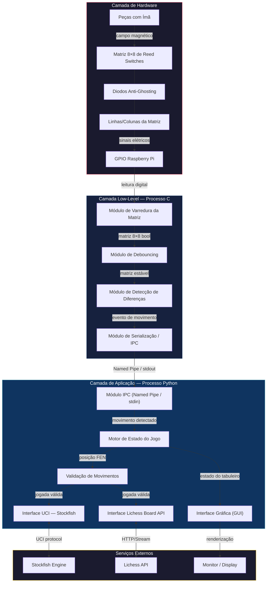

# Tabuleiro de Xadrez Eletrônico com Integração a Chess Engine

## 1. Motivação e Visão Geral do Projeto

O xadrez é tradicionalmente jogado de duas formas: presencialmente, sobre um tabuleiro físico, ou digitalmente, através de interfaces gráficas que permitem partidas contra outras pessoas ou contra motores de análise (chess engines). Cada modalidade tem vantagens que a outra não oferece — o tabuleiro físico proporciona a experiência tátil e sensorial do jogo tradicional, enquanto o ambiente digital abre acesso a oponentes virtuais de altíssimo nível, como o Stockfish, e a comunidades online, como o Lichess.

Este projeto nasce da vontade de unir essas duas experiências. A ideia central é permitir que um jogador utilize peças físicas reais, movimentando-as sobre um tabuleiro instrumentado eletronicamente, enquanto o "oponente" — seja ele uma engine de xadrez ou outro jogador humano conectado pela internet — existe apenas de forma virtual, sendo representado unicamente na interface gráfica do sistema. Dessa forma, o jogador físico interage com metade real e metade virtual do jogo, sem que isso comprometa a fluidez ou a legalidade das partidas.

Para viabilizar essa proposta, o sistema precisa resolver três desafios centrais:

1. **Detectar com precisão e rapidez** os movimentos realizados fisicamente no tabuleiro, sem exigir qualquer intervenção manual do jogador (como apertar botões ou usar um aplicativo à parte).
2. **Traduzir essas detecções em jogadas válidas**, comunicando-as tanto para uma chess engine local (Stockfish) quanto, opcionalmente, para uma partida online (Lichess).
3. **Refletir o estado completo do jogo** — as 32 peças, sendo 16 físicas e 16 virtuais — em uma interface gráfica clara e responsiva, mantendo o jogador sempre ciente da posição real da partida.

A solução proposta combina sensoriamento eletromagnético, processamento em tempo real de baixo nível e uma camada de aplicação rica em lógica de jogo, formando um sistema robusto, preciso e de baixa latência.

---

## 2. Especificação de Requisitos

### 2.1 Requisitos Funcionais

| ID | Requisito | Critério de Teste | Resultado Esperado |
|:---|:---------|:-------------------|:-------------------|
| **RF1** | Detecção das peças de xadrez no tabuleiro físico e de seus movimentos. | Posicionar as peças no estado inicial e realizar uma série de movimentos válidos e capturas no tabuleiro físico. | O sistema deve identificar a presença física das peças, detectar o movimento ocorrido e registrar corretamente as coordenadas de origem e destino na lógica interna. |
| **RF2** | Comunicação com uma chess engine que atue como oponente do jogador. | Enviar o estado atual do tabuleiro para a engine (via protocolo UCI) após a jogada do usuário físico. | A engine deve processar a posição atual, calcular a melhor resposta e retornar um movimento válido para o sistema. |
| **RF3** | Exibição, em interface gráfica, de ambas as partes do jogo (peças físicas e virtuais). | Iniciar uma partida, efetuando jogadas no tabuleiro físico e aguardando a resposta da engine; observar a tela da aplicação. | A tela deve renderizar um tabuleiro virtual com todas as 32 peças, refletindo visualmente a posição exata das peças físicas e das virtuais. |

### 2.2 Requisitos Não-Funcionais

| ID | Requisito | Critério de Teste | Resultado Esperado |
|:---|:----------|:------------------|:-------------------|
| **RNF1** | Detecção dos movimentos no tabuleiro de maneira rápida e sem falhas. | Executar 100 movimentos sequenciais (incluindo capturas e roque) no tabuleiro físico, avaliando o tempo de resposta dos sensores e a taxa de acerto. | 100% de precisão na detecção de qual peça foi movida e para onde, com tempo de leitura dos sensores inferior a 200 ms. |
| **RNF2** | Representação das jogadas na interface gráfica sem latência considerável. | Medir o tempo decorrido (delay) entre o registro do movimento processado pelo sistema e a renderização do novo estado na tela. | A atualização visual do tabuleiro gráfico deve ocorrer com latência inferior a 100 ms após o gatilho, garantindo fluidez. |
| **RNF3** | Robustez contra falsos positivos na leitura das peças (movimentos "fantasmas"). | Simular esbarrões leves no tabuleiro, trepidações ou passar a mão/peças rapidamente sobre as casas sem efetuar um movimento real. | O sistema deve filtrar ruídos e leituras temporárias, não registrando nenhum movimento espúrio na interface gráfica ou na engine. |

---

## 3. Arquitetura Proposta

### 3.1 Visão Geral

A arquitetura do sistema é organizada em três camadas — **Hardware/Sensoriamento**, **Controle Low-Level (C)** e **Aplicação/Interface (Python)** — interligadas por um mecanismo de comunicação interprocessos (IPC). Essa separação segue o princípio de *separation of concerns*: cada camada tem uma responsabilidade única e bem delimitada, o que facilita manutenção, testes isolados e evolução futura do sistema.

O tabuleiro físico é instrumentado com uma matriz 8×8 de reed switches, sensores magnéticos que são ativados pela aproximação de ímãs embutidos nas peças do jogador. Um Raspberry Pi realiza a varredura contínua dessa matriz, processa as leituras em um processo dedicado escrito em C — responsável pela detecção de baixa latência — e repassa os eventos de movimento para um processo em Python, que mantém a lógica do jogo, valida jogadas, comunica-se com a engine Stockfish (ou com a API do Lichess, para partidas online) e renderiza a interface gráfica.

### 3.2 Diagrama de Blocos

#### Descrição dos blocos

| Bloco | Camada | Responsabilidade |
|:------|:-------|:-----------------|
| Peças com Ímã | Hardware | Peças de xadrez do jogador, cada uma com um ímã acoplado, que ativam os reed switches ao serem posicionadas |
| Matriz 8×8 de Reed Switches | Hardware | Grade de 64 sensores magnéticos organizados em 8 linhas × 8 colunas |
| Diodos Anti-Ghosting | Hardware | Diodos em série com cada reed switch para evitar caminhos de corrente parasitas (*ghosting*) quando múltiplas peças estão no tabuleiro simultaneamente |
| GPIO Raspberry Pi | Hardware | Pinos de entrada/saída usados para ativar linhas e ler colunas |
| Módulo de Varredura | C | Varre sequencialmente cada linha da matriz, ativando-a e lendo as 8 colunas, produzindo uma matriz booleana 8×8 |
| Módulo de Debouncing | C | Aplica filtro temporal por amostragem consecutiva, exigindo estabilidade por N ciclos antes de confirmar uma mudança de estado |
| Módulo de Detecção de Diferenças | C | Compara a matriz atual com a anterior e identifica as casas que mudaram de estado |
| Módulo de Serialização/IPC | C | Formata e transmite as mudanças detectadas para o processo Python via Named Pipe ou `stdout` |
| Módulo IPC Python | Python | Recebe dados do processo C, desserializa e entrega ao motor de estado |
| Motor de Estado do Jogo | Python | Gerencia o estado interno do jogo (posição, turno, histórico), utilizando a biblioteca `python-chess` |
| Validação de Movimentos | Python | Verifica se o movimento detectado é legal segundo as regras do xadrez |
| Interface UCI — Stockfish | Python | Comunica-se com a engine Stockfish via protocolo UCI para obter jogadas do oponente virtual |
| Interface Lichess Board API | Python | Conecta-se à API Board do Lichess para partidas online |
| Interface Gráfica (GUI) | Python | Renderiza visualmente o tabuleiro completo (32 peças), mostrando tanto as peças físicas quanto as virtuais |

### 3.3 Fluxo Principal de Execução

O funcionamento do sistema pode ser resumido nas seguintes etapas, exemplificadas pelo cenário de uma partida contra o Stockfish:

1. O jogador move uma peça física no tabuleiro (por exemplo, de e2 para e4).
2. O processo C realiza a varredura contínua da matriz (ciclo de aproximadamente 10 ms), ativando cada linha e lendo o estado das colunas.
3. O módulo de debouncing exige estabilidade da leitura por N ciclos consecutivos antes de confirmar qualquer mudança, evitando ruídos.
4. O módulo de diferenças compara o estado atual com o anterior e identifica exatamente quais casas mudaram (e2 desativada, e4 ativada).
5. O evento de movimento é serializado e enviado ao processo Python via Named Pipe.
6. O processo Python interpreta o evento, valida a jogada com `python-chess` e atualiza o estado interno do jogo.
7. A interface gráfica é atualizada para refletir a jogada do jogador.
8. A posição atual é enviada ao Stockfish via protocolo UCI; a engine calcula e retorna a melhor jogada.
9. O sistema aplica a jogada da engine ao estado interno e atualiza novamente a interface gráfica, exibindo a resposta do oponente virtual.

Um fluxo análogo ocorre no modo online via Lichess Board API, onde a jogada do jogador é enviada por uma requisição HTTP e a jogada do oponente humano chega através de um *stream* de eventos. Movimentos identificados como ilegais pela validação em Python são rejeitados e o jogador é notificado na interface gráfica para reposicionar a peça corretamente.

### 3.4 Mapeamento entre Requisitos e Arquitetura

A tabela a seguir demonstra como cada requisito especificado é atendido por mecanismos concretos da arquitetura.

| Requisito | Mecanismo Arquitetural |
|:----------|:------------------------|
| **RF1** — Detecção de peças e movimentos | Varredura matricial (Matriz de Reed Switches → GPIO → Módulo de Varredura → Módulo de Diff) identifica as casas que mudaram de estado, determinando origem e destino de cada movimento. A identificação do *tipo* de peça é feita pelo software, que mantém um mapa lógico atualizado incrementalmente. |
| **RF2** — Comunicação com chess engine | A biblioteca `python-chess` encapsula o protocolo UCI, enviando a posição atual (FEN + histórico) ao Stockfish via `stdin`/`stdout` e recebendo a melhor jogada calculada. |
| **RF3** — Exibição gráfica de ambas as partes | O Motor de Estado mantém a representação canônica do tabuleiro; a GUI a consulta para renderizar as 32 peças, atualizando as peças do jogador conforme os sensores e as do oponente conforme a engine ou o stream do Lichess. |
| **RNF1** — Detecção rápida e sem falhas (<200 ms) | Ciclo de varredura de ~10 ms para as 8 linhas somado a debouncing de 5 ciclos resulta em latência total estimada de 50–60 ms, bem abaixo do limite exigido. Diodos anti-ghosting garantem leitura precisa com múltiplas peças simultâneas. |
| **RNF2** — GUI sem latência considerável (<100 ms) | A comunicação via Named Pipe entre processos no mesmo Raspberry Pi ocorre em microssegundos; a renderização incremental (redesenho apenas das casas alteradas) mantém a atualização visual em poucos milissegundos. |
| **RNF3** — Robustez contra falsos positivos | Dupla barreira de proteção: debouncing em C (exige N leituras consecutivas idênticas) e validação semântica em Python (descarta transições que não correspondem a jogadas legais). |

### 3.5 Justificativas das Principais Decisões Arquiteturais

**Separação em dois processos (C e Python).** O C foi escolhido para a camada de hardware por oferecer controle direto sobre GPIOs com temporização precisa, essencial à varredura matricial em tempo real. O Python foi escolhido para a camada de aplicação pela disponibilidade da biblioteca `python-chess`, que já oferece representação de estado, validação de regras e integração nativa com engines UCI — evitando reimplementar essa lógica em C.

**Comunicação via Named Pipe (FIFO).** Trata-se de um mecanismo de IPC nativo do Linux que equilibra simplicidade de implementação e desempenho adequado, já que os eventos transmitidos são curtos e esporádicos. Alternativas como memória compartilhada ou sockets Unix foram descartadas por adicionarem complexidade desnecessária para esse volume de dados.

**Varredura matricial com diodos anti-ghosting.** A técnica permite ler 64 sensores utilizando apenas 16 pinos GPIO (8 linhas + 8 colunas), reduzindo a fiação necessária. Os diodos em série evitam que múltiplos switches fechados simultaneamente — situação comum, já que até 16 peças do jogador podem estar no tabuleiro ao mesmo tempo — gerem leituras falsas por caminhos de corrente parasitas.

**Debouncing por amostragem consecutiva em software.** Preferido ao debouncing por hardware (filtro RC) por três razões: economia de componentes (evita 64 pares de resistor/capacitor adicionais), flexibilidade (o limiar de estabilidade é ajustável por software) e adequação ao cenário, já que o Raspberry Pi tem capacidade de processamento suficiente para executar essa filtragem sem impacto perceptível de desempenho.

**Protocolo UCI para comunicação com o Stockfish.** O UCI é o padrão de fato para engines modernas, com natureza *stateless* e baseada em texto que simplifica a integração. O Stockfish, reconhecidamente a engine open-source mais forte disponível, utiliza UCI nativamente.

**Lichess Board API para jogos online.** Diferentemente da Bot API (voltada a contas automatizadas), a Board API foi projetada especificamente para permitir que tabuleiros físicos externos interajam com a plataforma usando contas regulares, o que se adequa diretamente ao caso de uso deste projeto.

**Renderização incremental na interface gráfica.** Redesenhar apenas as casas cujo estado mudou, em vez do tabuleiro inteiro a cada atualização, é uma técnica padrão para minimizar o tempo de resposta visual, contribuindo diretamente para o cumprimento do requisito de latência inferior a 100 ms.

---

## 4. Desenvolvimento

Para a primeira semana, o grupo concentrou seus esforços em desenvolver uma prototipação do projeto. O objetivo foi criar um protótipo da lógica de detecção de movimentos das peças, conectado ao sistema do Lichess.

Foram implementados módulos em Python que organizam o fluxo completo do sistema, desde a leitura dos eventos do tabuleiro até a interação com a engine e a interface gráfica. O código foi estruturado para separar responsabilidades e facilitar a validação de jogadas, a comunicação com serviços externos e a apresentação visual do estado do jogo.

No lado de hardware, um programa simples para testar se a montagem física com os reed switches estava funcional também foi feita, validando a viabilidade técnica da construção.

- app/main.py: ponto de entrada da aplicação, responsável por orquestrar o fluxo principal, os modos de execução e o ciclo de funcionamento do sistema.
- app/game_state.py: motor de estado do jogo, baseado na biblioteca python-chess, responsável por manter a posição, aplicar movimentos e gerar informações como FEN e histórico.
- app/move_interpreter.py: interpreta mudanças detectadas nos sensores e converte-as em jogadas de xadrez, tratando casos como captura, roque e promoção.
- app/ipc_reader.py: recebe eventos vindos do processo C ou de mocks, desserializa as alterações do tabuleiro e entrega o conteúdo ao restante da aplicação.
- app/gui.py: implementa a interface gráfica com pygame, exibindo o tabuleiro virtual, destaque de movimentos e mensagens de status.
- app/stockfish_engine.py: integra a aplicação com o Stockfish via protocolo UCI, permitindo respostas automáticas do oponente virtual.
- app/lichess_client.py: conecta o sistema à Board API do Lichess para partidas online com jogadores humanos ou IA.
- poc_xadrez/poc_xadrez.ino e mock/: concentram a base de prova de conceito para o hardware e os testes de simulação do sistema.

## 5. Considerações Finais

A arquitetura proposta busca equilibrar dois objetivos que, à primeira vista, podem parecer conflitantes: a baixíssima latência exigida pelo sensoriamento físico e a riqueza de lógica necessária para validar e apresentar uma partida de xadrez completa. A divisão em camadas — com um processo em C dedicado exclusivamente ao hardware e um processo em Python dedicado à lógica de aplicação — permite que cada parte do sistema seja otimizada para seu propósito específico, sem comprometer a responsividade nem a corretude das regras do jogo.

O resultado é um sistema capaz de detectar jogadas físicas com alta precisão e baixa latência, comunicar-se de forma transparente com uma chess engine de referência mundial ou com uma plataforma online consolidada, e apresentar ao jogador uma visão completa e sincronizada da partida — unindo, assim, a experiência tátil do xadrez tradicional à conectividade e ao poder analítico do xadrez digital.
