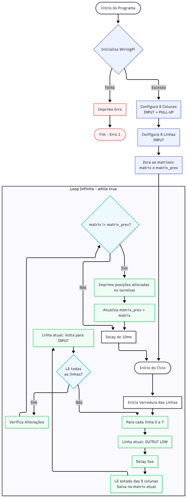

# Relatório da Semana 2 do Projeto

## 1. Desenvolvimento de Software
A partir do código desenvolvido na semana 1, o grupo adaptou a prova de conceito feita para Arduino para uma versão em C++ pronta para rodar diretamente na Raspberry Pi do laboratório, junto do programa em Python. Foi validada a leitura correta da matriz de reed switches pela Raspberry Pi.
### 1.1. Arquitetura em C++

---

## 2. Desenvolvimento de Hardware
Foi criada uma versão inicial do que viria a ser o tabuleiro físico de xadrez. A partir de alguns testes com uma pequena matriz de reed switches com diodos, o grupo concluiu que a chapa de acrílico comprada estaria grande demais para ser viável, pois o alcance dos ímãs era pequeno demais para cobrir adequadamente a área de cada casa. No entanto, foi possível validar a detecção do contato que o ímã sob a peça de xadrez através da chapa de acrílico para controle do jogo.

---

## 3. Revisão por Pares
O grupo também teve a oportunidade de estudar os projetos sendo desenvolvidos por outros grupos, bem como dar e receber sugestões de melhorias.
### 3.1. Feedbacks recebidos
O grupo recebeu 2 feedbacks:
- Grupo B: Feedbacks positivos de alguns aspectos do projeto, e duas sugestões: modo offline e tratamento de erro. Consideramos, a princípio, que um modo offline está fora do escopo do projeto atual. O tratamento de erros já está implementado, mas pretendemos desenvolver melhor a interface visual para melhorar o alerta ao usuário.
- Grupo I: A sugestão dada foi trocar a implementação atual, em que os diferentes modos de jogo são configurados via CLI, por uma interface visual interativa. Por enquanto utilizamos a CLI por conveniênvia de desenvolvimento, mas avaliaremos a viabilidade de uma interface mais amigável ao usuário final.
### 3.2. Sugestões enviadas
O grupo avaliou os projetos dos colegas, e oferecemos sugestões a dois grupos:
- Grupo S: Sugerimos que, ao invés de utilizar os botões já inclusos na placa de desenvolvimento do laboratório, fossem criados botões na própria caixa/cofre para ativar o reconhecimento facial. A ideia é desacoplar o projeto da placa da Freenove, focando na Raspberry Pi e seus periféricos essenciais, além de melhorar a experiência do usuário.
- Grupo P: O projeto conta com um regulador de velocidade determinado por um potenciômetro. A sugestão dada é que, como a definição da velocidade é feita ao iniciar a partida, houvesse um indicador visual da velocidade selecionada antes de iniciá-la, e não somente após o começo do jogo, qunado não é mais alterável.